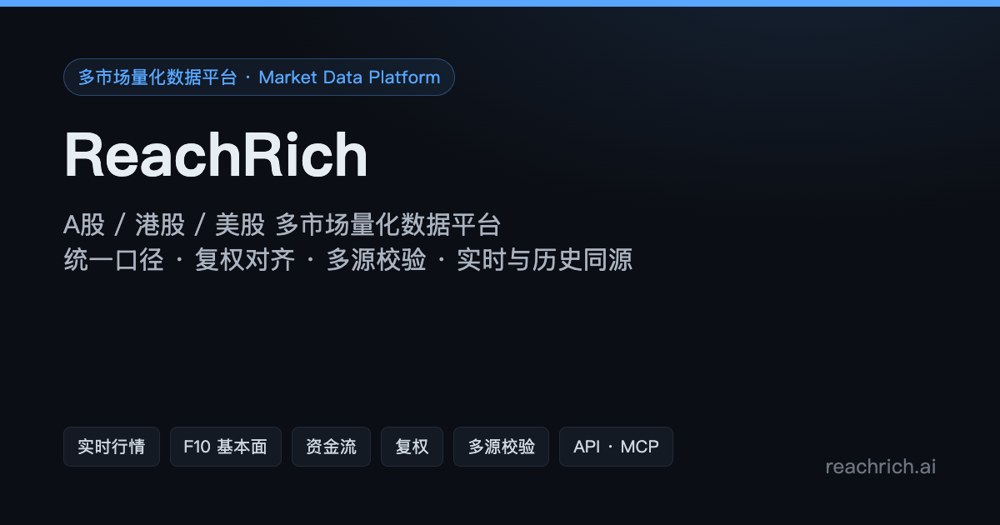
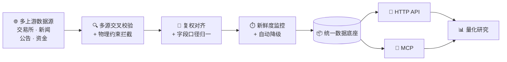
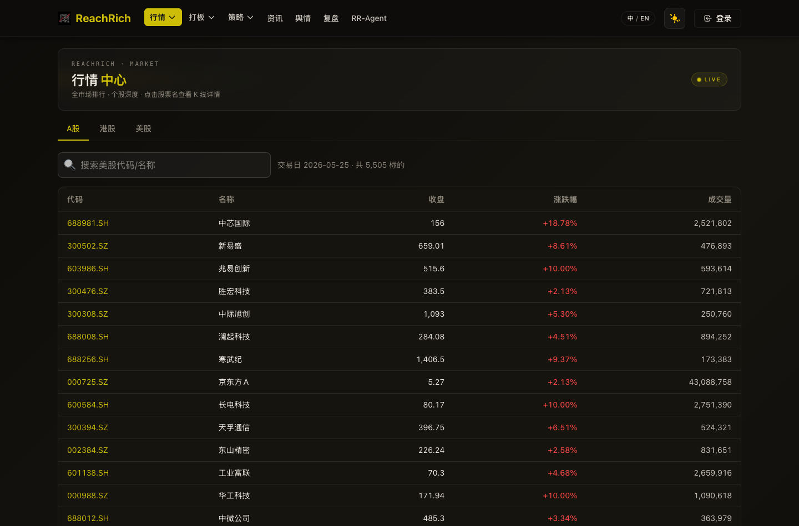
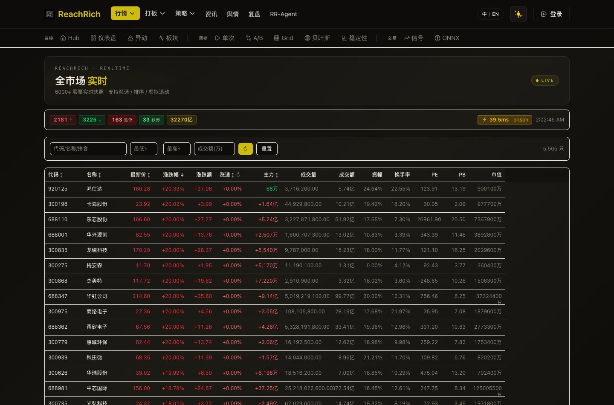

<p align="center">
  
</p>

<h1 align="center">ReachRich</h1>

<p align="center">
  <b>A股 / 港股 / 美股 多市场量化数据平台</b><br>
  <sub>Multi-market data platform for China A-share, HK & US equities — built for quantitative research</sub>
</p>

<p align="center">
  <a href="https://reachrich.ai"></a>
  <a href="https://data.show.reachrich.ai/insights/"></a>
  <a href="https://github.com/pagliazi/rr-agent-site"></a>
</p>

<p align="center">
  
  
  
  
  
</p>

---

> 🪟 **公开展示项目(Showcase)** — 本仓库仅为 ReachRich 产品能力展示,**非完整代码、非真实数据**;不含后端代码、凭证或部署信息。完整产品见 [reachrich.ai](https://reachrich.ai)。
>
> 所有内容仅供数据研究用途,**不构成投资建议、投资参考、荐股或收益承诺**;投资有风险,历史业绩不代表未来。

## 📌 是什么

**自研** 多市场量化数据平台。把"找数据、清数据、对数据"做成一层稳定服务:**统一口径 · 复权对齐 · 多源交叉校验 · 实时与历史同源**,并内建新鲜度与质量监控。**量化研究只管用数据,不必再为数据本身耗工。**

## 🎯 解决的问题

量化里最耗人的不是策略,而是数据。源头零散、字段口径不一、复权各异、实时与历史对不上、单源偶发缺失/错值、质量无人盯——每一项都足以让研究结论失真。

| 痛点 | ReachRich 的处理 |
|---|---|
| ❌ 多源口径不一 | ✅ 统一数据契约:字段、单位、复权方式一致 |
| ❌ 复权混乱、隔夜假跳空触发误止损 | ✅ 前/后复权与除权除息一致处理,价格连续 |
| ❌ 实时与历史两套数据,回测/盘中对不上 | ✅ 同源同口径,回测—盘中无缝衔接 |
| ❌ 单源不可靠,偶发缺失/错值 | ✅ 多源交叉校验 + 自动降级/切换 |
| ❌ 数据是否新鲜没人盯 | ✅ 每类数据新鲜度阈值监控 + 告警 |
| ❌ 脏数据混入因子 | ✅ 物理约束校验(价格区间、量价合理性)拦截 |

## 🗺️ 数据流



## 🚀 立即体验

| 入口 | 说明 |
|---|---|
| **[🌐 reachrich.ai](https://reachrich.ai)** | 进入实时数据门户(真实产品) |
| **[📚 洞察文章](https://data.show.reachrich.ai/insights/)** | 6 篇 cornerstone(复权 / 多源校验 / 微结构 / API vs MCP / F10 派生 / 情感分析) |
| **[📊 数据覆盖](docs/data-coverage.md)** | 完整覆盖矩阵 |
| **[🔌 接入方式](docs/access.md)** | API + MCP 详解 |

## 📊 数据覆盖

| 类别 | 内容 |
|---|---|
| 🏛️ **市场** | A 股(沪深主板 / 创业板 / 科创板 / 北交所)· 港股主板 · 美股主要交易所 |
| 📈 **行情** | 实时快照 · 分时 · 日/分钟/周/月 K · 秒级集合竞价 · 逐笔 |
| 🔁 **复权** | 前复权 / 后复权 / 除权除息因子 |
| 📰 **资讯** | 财经新闻 · 公告 · 情绪标注 · AI 摘要 |
| 🏢 **基本面** | F10 · 财务报表 · 估值 · 分红送转 |
| 💰 **资金** | 主力资金流 · 龙虎榜 · 北向资金 · 大宗交易 |
| 🏷️ **板块** | 概念 · 行业 · 指数成分 · 板块轮动与情绪 |

→ [完整覆盖矩阵](docs/data-coverage.md)

## 🖼️ 界面

行情数据:



<details>
<summary>📊 <b>更多界面</b>(全市场实时)</summary>

<br>



</details>

> 真实界面截图(reachrich.ai 公开页),已脱敏。

## 🛡️ 稳定与准确

- 🔍 **多源交叉校验** — 同一指标多源比对,偏离超阈值自动标记 / 取信更可靠源
- ⏱️ **新鲜度监控** — 每类数据有时效阈值,过期即告警
- 🧪 **物理约束校验** — `最高价 ≥ 最低价` 等规则拦截脏数据
- ♻️ **多源容错** — 单一上游异常自动降级 / 切换,不中断下游取数
- 🩺 **高可用 7×24** — 核心服务异常自愈 + 中央健康监测

→ [稳定与准确详解](docs/reliability.md)

## 📚 洞察 · 数据工程深度科普

| 主题 | 关键词 |
|---|---|
| 🔄 [A股复权处理:前/后复权与除权除息一致性](https://data.show.reachrich.ai/insights/a-share-price-adjustment.html) | 复权 · 除权除息 · XDXR |
| 🛡️ [多源数据校验 + 新鲜度监控](https://data.show.reachrich.ai/insights/multi-source-data-validation.html) | 数据质量 · 校验 · 新鲜度 |
| 📉 [逐笔与微结构数据:大单分类与 Lee-Ready](https://data.show.reachrich.ai/insights/tick-data-microstructure.html) | 逐笔 · 微结构 · 内外盘 |
| 🔌 [API vs MCP:量化数据接入两种范式](https://data.show.reachrich.ai/insights/api-vs-mcp-quant-data.html) | API · MCP · 数据接入 |
| 📊 [F10 基本面派生:ROE/EPS/BVPS 口径与一致性](https://data.show.reachrich.ai/insights/f10-fundamental-derivation.html) | F10 · ROE · 基本面 |
| 💬 [新闻情感分析:词典法 vs ML 模型的取舍](https://data.show.reachrich.ai/insights/news-sentiment-dict-vs-ml.html) | 情感分析 · NLP · LLM |

## 🔗 与 RR-Agent 的关系

ReachRich 是**数据底座(被调用方)**,只负责把数据做对、做稳、做全。上层量化研究智能体 **[RR-Agent](https://github.com/pagliazi/rr-agent-site)** 通过 API / MCP 调用 ReachRich 取数,完成因子挖掘、选股、组合优化与执行。两者职责分离、独立演进。

```
RR-Agent (调用方, 独立项目)  ──→  API / MCP  ──→  ReachRich (本项目, 被调用方)
                                                 ↑
                                                 │
                                             reachrich.ai
```

→ 体验上层 Agent:[agent.show.reachrich.ai](https://agent.show.reachrich.ai/)

## 📁 仓库结构

```
.
├─ README.md              # 本文档
├─ README.en.md           # English
├─ docs/                  # 完整文档(GitHub 直接渲染)
├─ insights/              # 6 篇 cornerstone 文章(HTML, 经 Pages 渲染)
├─ assets/                # 截图 / og 图 / logo
├─ sitemap.xml / robots.txt / llms.txt
└─ SECURITY.md / LICENSE
```

## ⚠️ 免责声明

本仓库为数据平台能力展示,所有内容仅供数据研究用途,**不作为任何投资参考依据**。投资有风险,历史业绩不代表未来;不对任何收益、回报或本金安全作出承诺;不构成投资建议、投资参考、荐股或要约。

## 📄 License

[MIT](LICENSE) — Showcase 仓库,不含产品本体代码。
安全披露见 [SECURITY.md](SECURITY.md)。

---

<p align="center">
  <sub><b>统一口径 · 复权对齐 · 多源校验 · 实时与历史同源</b></sub><br>
  <sub>© 2026 ReachRich · <a href="https://reachrich.ai">reachrich.ai</a> · <a href="https://github.com/pagliazi/rr-agent-site">RR-Agent</a></sub>
</p>
